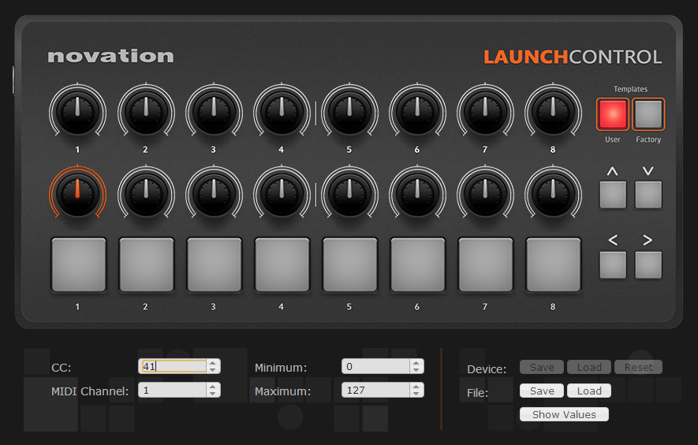

# Launch-Controller
A wrapper for the MIDI Controller Novation LaunchControl.  It simplifies reading the value of knobs and pads from the MIDI controller.
The Novation LaunchControl has 16 knobs and 8 pads. You can assign [Control Change (CC) messages](https://www.midi.org/specifications/item/table-3-control-change-messages-data-bytes-2)  to knobs, and notes to pads. 


## Credits
Launch Controller uses the library [RtMidi](https://github.com/thestk/rtmidi)

# How to use it
1. Declare and instantiate a LaunchControl property in your code
```c++
LaunchControl* launchControl;
...
//using MIDI controller 
launchControl = new LaunchControl(false,true);
launchControl->resetLaunchControl(templateNumber);
```
2. Use the values of KNOB_X_LOW and KNOB_X_UPPER, replacing X with 1 to 8 according to the knob. This example uses the values of knobs as parameters in an OpenFrameworks sketch.
If you're not familiar with OpenFrameworks, it is relevant to mention that update() is called by the engine, which makes it possible to simply read the last values of the knobs.
```c++
void ofApp::update() {
	// "lastBuffer" is shared between update() and audioOut(), which are called
	// on two different threads. This lock makes sure we don't use lastBuffer
	// from both threads simultaneously (see the corresponding lock in audioOut())
	unique_lock<mutex> lock(audioMutex);
	
  //Using a knob to control the value of parameters
	guiSliderScale = ofMap(launchControl->KNOB_1_LOW[2], 0, 127, guiSliderScale.getMin(), guiSliderScale.getMax());
	guiSliderPhase = ofMap(launchControl->KNOB_2_LOW[2], 0, 127, guiSliderPhase.getMin(), guiSliderPhase.getMax());
	anglePhase = ofMap(launchControl->KNOB_2_LOW[2], 0, 127, 0, 100);
	
	//Using a pad to map to a boolean variable
	guiToggleAudioReactive = launchControl->PAD_1[2];
	guiToggleRotatePattern = launchControl->PAD_2[2];
	guiToggleRectangle = launchControl->PAD_3[2];
```
